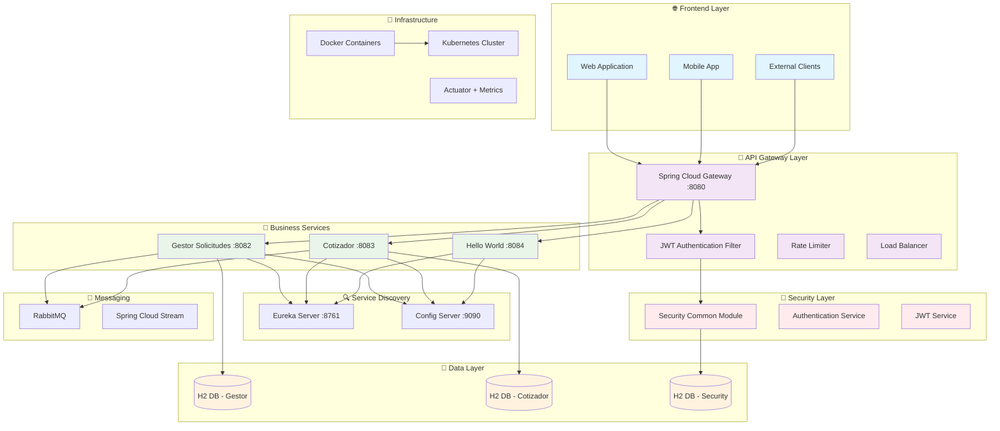
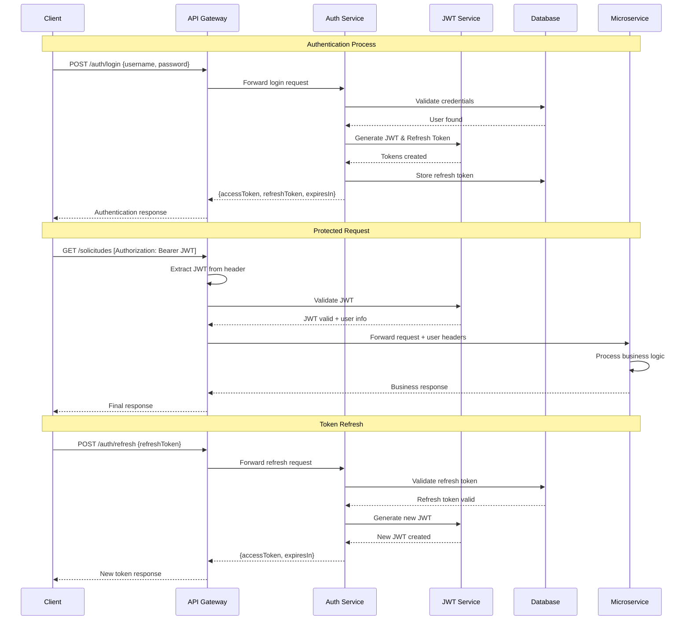
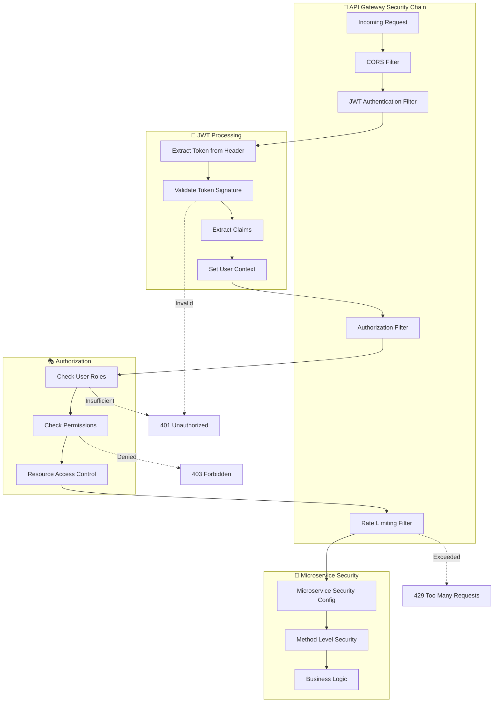
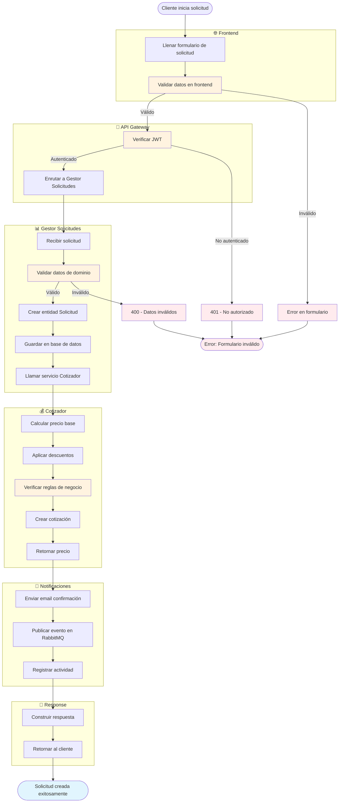
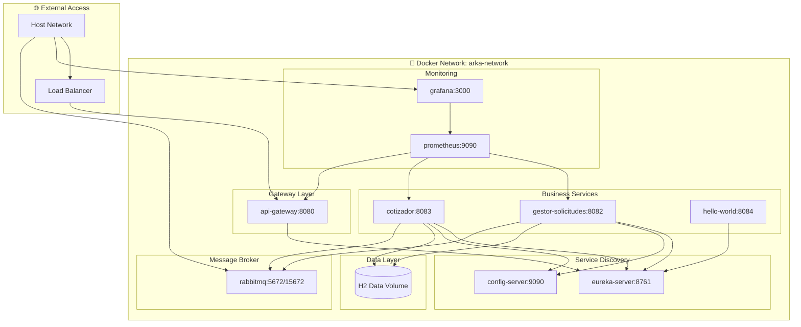
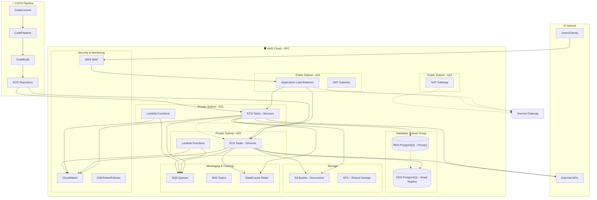

# 🏗️ Diagramas de Arquitectura - Proyecto ARKA

## 📊 Arquitectura General del Sistema

### Vista de Alto Nivel



---

## 🏛️ Arquitectura Hexagonal por Microservicio

### Gestor de Solicitudes - Arquitectura Detallada

```mermaid
graph TB
    subgraph "🌐 External World"
        WEB_CLIENT[Web Client]
        API_GATEWAY[API Gateway]
        RABBITMQ[RabbitMQ]
        EXTERNAL_API[External APIs]
    end
    
    subgraph "📡 Infrastructure Layer (Adapters)"
        subgraph "🔌 Input Adapters"
            REST_CONTROLLER[REST Controllers]
            MESSAGE_HANDLER[Message Handlers]
            SCHEDULED_TASKS[Scheduled Tasks]
        end
        
        subgraph "🔌 Output Adapters"
            JPA_REPO[R2DBC Repositories]
            MESSAGE_PUBLISHER[Message Publishers]
            HTTP_CLIENT[HTTP Clients]
            EMAIL_SERVICE[Email Service]
        end
        
        subgraph "⚙️ Configuration"
            SECURITY_CONFIG[Security Config]
            DATABASE_CONFIG[Database Config]
            MESSAGING_CONFIG[Messaging Config]
        end
    end
    
    subgraph "🎯 Application Layer"
        subgraph "📋 Use Cases"
            CREATE_SOLICITUD[Create Solicitud Use Case]
            UPDATE_SOLICITUD[Update Solicitud Use Case]
            GENERATE_COTIZACION[Generate Cotizacion Use Case]
            TRACK_ENVIO[Track Envio Use Case]
        end
        
        subgraph "🎭 Application Services"
            SOLICITUD_APP_SERVICE[Solicitud Application Service]
            COTIZACION_APP_SERVICE[Cotizacion Application Service]
            NOTIFICATION_SERVICE[Notification Service]
        end
    end
    
    subgraph "🏛️ Domain Layer (Core)"
        subgraph "🎯 Domain Model"
            SOLICITUD[Solicitud Entity]
            COTIZACION[Cotizacion Entity]
            ENVIO[Envio Entity]
            CLIENTE[Cliente Value Object]
            DIRECCION[Direccion Value Object]
        end
        
        subgraph "🔍 Domain Services"
            COTIZACION_DOMAIN_SERVICE[Cotizacion Domain Service]
            VALIDACION_SERVICE[Validacion Service]
            CALCULO_SERVICE[Calculo Service]
        end
        
        subgraph "🚪 Ports (Interfaces)"
            SOLICITUD_PORT[Solicitud Repository Port]
            COTIZACION_PORT[Cotizacion Repository Port]
            NOTIFICATION_PORT[Notification Port]
            PAYMENT_PORT[Payment Port]
        end
    end
    
    %% External to Input Adapters
    WEB_CLIENT --> REST_CONTROLLER
    API_GATEWAY --> REST_CONTROLLER
    RABBITMQ --> MESSAGE_HANDLER
    
    %% Input Adapters to Application Layer
    REST_CONTROLLER --> CREATE_SOLICITUD
    REST_CONTROLLER --> UPDATE_SOLICITUD
    REST_CONTROLLER --> GENERATE_COTIZACION
    MESSAGE_HANDLER --> TRACK_ENVIO
    
    %% Application Layer to Domain
    CREATE_SOLICITUD --> SOLICITUD_APP_SERVICE
    UPDATE_SOLICITUD --> SOLICITUD_APP_SERVICE
    GENERATE_COTIZACION --> COTIZACION_APP_SERVICE
    
    SOLICITUD_APP_SERVICE --> SOLICITUD
    COTIZACION_APP_SERVICE --> COTIZACION
    COTIZACION_APP_SERVICE --> COTIZACION_DOMAIN_SERVICE
    
    %% Domain to Ports
    SOLICITUD --> SOLICITUD_PORT
    COTIZACION --> COTIZACION_PORT
    NOTIFICATION_SERVICE --> NOTIFICATION_PORT
    
    %% Ports to Output Adapters
    SOLICITUD_PORT -.-> JPA_REPO
    COTIZACION_PORT -.-> JPA_REPO
    NOTIFICATION_PORT -.-> MESSAGE_PUBLISHER
    NOTIFICATION_PORT -.-> EMAIL_SERVICE
    PAYMENT_PORT -.-> HTTP_CLIENT
    
    %% Output Adapters to External
    JPA_REPO --> H2_DB[(H2 Database)]
    MESSAGE_PUBLISHER --> RABBITMQ
    HTTP_CLIENT --> EXTERNAL_API
    
    %% Styling
    classDef domain fill:#e8f5e8,stroke:#4caf50,stroke-width:3px
    classDef application fill:#fff3e0,stroke:#ff9800,stroke-width:2px
    classDef infrastructure fill:#e1f5fe,stroke:#2196f3,stroke-width:2px
    classDef external fill:#f3e5f5,stroke:#9c27b0,stroke-width:2px
    
    class SOLICITUD,COTIZACION,ENVIO,CLIENTE,DIRECCION,COTIZACION_DOMAIN_SERVICE,VALIDACION_SERVICE,CALCULO_SERVICE,SOLICITUD_PORT,COTIZACION_PORT,NOTIFICATION_PORT,PAYMENT_PORT domain
    
    class CREATE_SOLICITUD,UPDATE_SOLICITUD,GENERATE_COTIZACION,TRACK_ENVIO,SOLICITUD_APP_SERVICE,COTIZACION_APP_SERVICE,NOTIFICATION_SERVICE application
    
    class REST_CONTROLLER,MESSAGE_HANDLER,SCHEDULED_TASKS,JPA_REPO,MESSAGE_PUBLISHER,HTTP_CLIENT,EMAIL_SERVICE,SECURITY_CONFIG,DATABASE_CONFIG,MESSAGING_CONFIG infrastructure
    
    class WEB_CLIENT,API_GATEWAY,RABBITMQ,EXTERNAL_API external
```



---

## 🔐 Arquitectura de Seguridad

### JWT Authentication Flow



### Security Filter Chain



---

## 📊 Diagrama de Flujo de Datos

### Flujo Completo de Creación de Solicitud



---

## 🐳 Arquitectura de Contenedores

### Docker Compose Structure



---

## ☁️ Arquitectura AWS (Propuesta)

### Infrastructure Diagram



### AWS Services Mapping

| Componente ARKA | Servicio AWS | Configuración |
|------------------|--------------|---------------|
| **API Gateway** | Application Load Balancer + WAF | Multi-AZ, SSL/TLS, Rate limiting |
| **Microservicios** | ECS Fargate + ECR | Auto-scaling, Service discovery |
| **Base de Datos** | RDS PostgreSQL | Multi-AZ, Read replicas, Backup |
| **Configuración** | Systems Manager Parameter Store | Encrypted parameters |
| **Archivos** | S3 | Versioning, Encryption, Lifecycle |
| **Caché** | ElastiCache Redis | Cluster mode, Multi-AZ |
| **Mensajería** | SQS + SNS | Dead letter queues, Encryption |
| **Funciones** | Lambda | Serverless processing |
| **Monitoreo** | CloudWatch + X-Ray | Logs, Metrics, Tracing |
| **Seguridad** | IAM + Secrets Manager | Least privilege, Rotation |

---

## 📈 Diagramas de Monitoreo y Observabilidad

### Health Check Flow

```mermaid
graph LR
    subgraph "🏥 Health Monitoring"
        ACTUATOR[Spring Actuator]
        HEALTH_ENDPOINT[/actuator/health]
        METRICS_ENDPOINT[/actuator/metrics]
        INFO_ENDPOINT[/actuator/info]
    end
    
    subgraph "📊 Monitoring Tools"
        PROMETHEUS[Prometheus]
        GRAFANA[Grafana]
        ALERT_MANAGER[Alert Manager]
    end
    
    subgraph "📱 Notifications"
        SLACK[Slack]
        EMAIL[Email]
        PAGERDUTY[PagerDuty]
    end
    
    ACTUATOR --> HEALTH_ENDPOINT
    ACTUATOR --> METRICS_ENDPOINT
    ACTUATOR --> INFO_ENDPOINT
    
    PROMETHEUS --> HEALTH_ENDPOINT
    PROMETHEUS --> METRICS_ENDPOINT
    
    GRAFANA --> PROMETHEUS
    ALERT_MANAGER --> PROMETHEUS
    
    ALERT_MANAGER --> SLACK
    ALERT_MANAGER --> EMAIL
    ALERT_MANAGER --> PAGERDUTY
```

---

## 📝 Conclusiones de Arquitectura

### ✅ Fortalezas del Diseño

1. **Separación de Responsabilidades**: Clara separación entre capas y dominios
2. **Escalabilidad**: Arquitectura preparada para crecimiento horizontal
3. **Mantenibilidad**: Código organizado y principios SOLID aplicados
4. **Testabilidad**: Interfaces que permiten testing unitario e integración
5. **Flexibilidad**: Adaptadores intercambiables sin afectar el dominio

### 🎯 Recomendaciones de Mejora

1. **Implementar Circuit Breaker** más robusto con Hystrix Dashboard
2. **Agregar Service Mesh** (Istio) para comunicación inter-servicios
3. **Implementar CQRS** para casos de uso complejos
4. **Mejorar observabilidad** con distributed tracing
5. **Automatizar deployment** con GitOps (ArgoCD)

### 📊 Métricas de Calidad Arquitectural

- **Acoplamiento**: Bajo ✅
- **Cohesión**: Alta ✅  
- **Complejidad**: Moderada ✅
- **Mantenibilidad**: Alta ✅
- **Testabilidad**: Alta ✅
- **Escalabilidad**: Alta ✅
