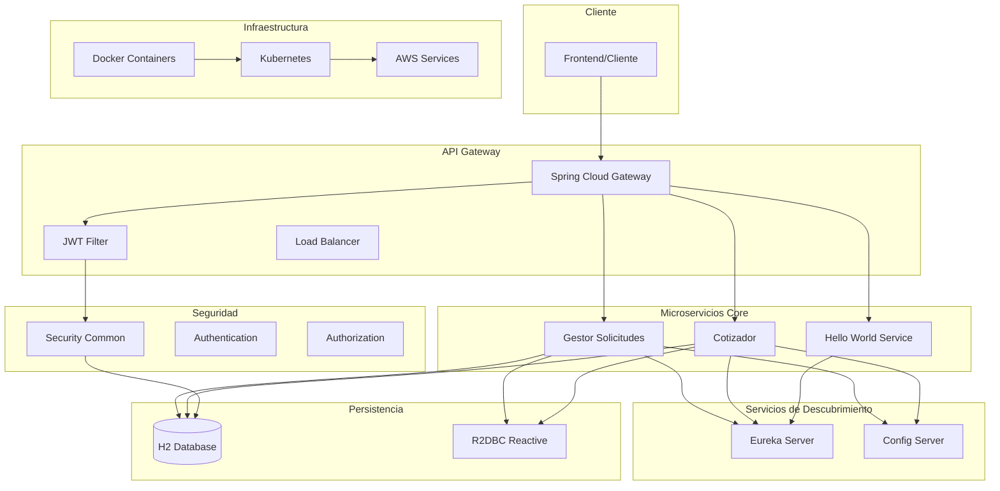
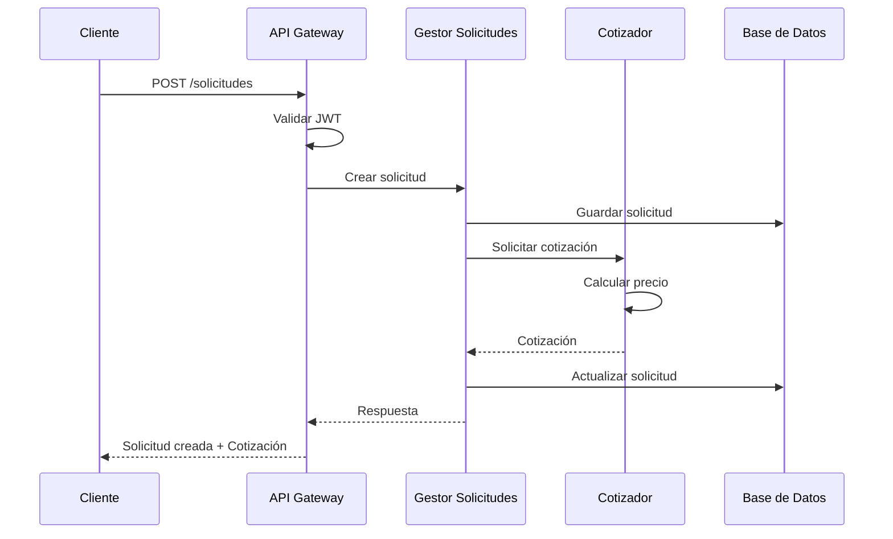

# 🏗️ Proyecto ARKA - Sistema de Microservicios con Arquitectura Hexagonal

## 📖 Tabla de Contenidos

1. [Introducción](#introducción)
2. [Arquitectura del Sistema](#arquitectura-del-sistema)
3. [Lenguaje Ubicuo](#lenguaje-ubicuo)
4. [Microservicios Implementados](#microservicios-implementados)
5. [Tecnologías Utilizadas](#tecnologías-utilizadas)
6. [Evaluación de Requerimientos](#evaluación-de-requerimientos)
7. [Configuración y Despliegue](#configuración-y-despliegue)
8. [Diagramas de Arquitectura](#diagramas-de-arquitectura)

---

## 🎯 Introducción

**ARKA** es un sistema distribuido de microservicios desarrollado con **Arquitectura Hexagonal** y principios de **Domain-Driven Design (DDD)**. El sistema gestiona solicitudes de envío, cotizaciones y servicios relacionados con logística y transporte.

### 🎯 Objetivo del Sistema

Proporcionar una plataforma robusta y escalable para la gestión de:
- **Solicitudes de envío** y seguimiento
- **Cotizaciones** dinámicas basadas en múltiples factores
- **Gestión de usuarios** con roles diferenciados
- **Integración** con servicios externos

---

## 🏛️ Arquitectura del Sistema

### 📊 Diagrama de Arquitectura General



### 🏗️ Arquitectura Hexagonal por Microservicio

```
📁 Microservicio/
├── 🎯 domain/                 # Núcleo del Dominio
│   ├── model/                 # Entidades del Dominio
│   │   ├── Solicitud.java     # Agregado raíz
│   │   ├── Cotizacion.java    # Entidad
│   │   └── Usuario.java       # Entidad
│   ├── port/                  # Puertos (Interfaces)
│   │   ├── in/               # Puertos de Entrada
│   │   │   ├── SolicitudUseCase.java
│   │   │   └── CotizacionUseCase.java
│   │   └── out/              # Puertos de Salida
│   │       ├── SolicitudRepository.java
│   │       └── NotificationService.java
│   └── service/              # Servicios de Dominio
│       ├── SolicitudService.java
│       └── CotizacionService.java
├── 🔌 infrastructure/         # Adaptadores Externos
│   ├── adapter/
│   │   ├── in/               # Adaptadores de Entrada
│   │   │   ├── web/          # REST Controllers
│   │   │   └── messaging/    # Message Handlers
│   │   └── out/              # Adaptadores de Salida
│   │       ├── persistence/  # JPA/R2DBC Repositories
│   │       ├── messaging/    # RabbitMQ/Kafka
│   │       └── external/     # APIs externas
│   └── config/               # Configuraciones
└── 🚀 application/           # Casos de Uso
    └── usecase/
        ├── CrearSolicitudUseCase.java
        └── CalcularCotizacionUseCase.java
```

---

## 🗣️ Lenguaje Ubicuo

### 📚 Glosario del Dominio

#### 🏢 Contexto de Negocio: Logística y Envíos

| Término | Definición | Implementación en Código |
|---------|------------|---------------------------|
| **Solicitud** | Petición formal de un cliente para enviar un paquete desde un origen a un destino | `Solicitud.java` (Entidad/Agregado) |
| **Cotización** | Estimación de precio para un envío basada en peso, distancia y tipo de servicio | `Cotizacion.java` (Entidad) |
| **Cliente** | Usuario que solicita servicios de envío | `Usuario.java` con rol `USUARIO` |
| **Gestor** | Empleado que administra y supervisa las solicitudes de envío | `Usuario.java` con rol `GESTOR` |
| **Operador** | Empleado que ejecuta las operaciones de envío | `Usuario.java` con rol `OPERADOR` |
| **Administrador** | Usuario con máximos privilegios del sistema | `Usuario.java` con rol `ADMINISTRADOR` |
| **Envío** | Proceso físico de transportar un paquete | `EnvioService.java` |
| **Tracking** | Seguimiento del estado de un envío | `TrackingInfo.java` |
| **Destino** | Ubicación final donde se entrega el paquete | Campo `destino` en Solicitud |
| **Origen** | Ubicación inicial desde donde se envía el paquete | Campo `origen` en Solicitud |
| **Peso** | Masa del paquete a enviar (factor de cotización) | Campo `peso` en Solicitud |
| **Dimensiones** | Medidas físicas del paquete | Campos `largo`, `ancho`, `alto` |
| **Estado de Solicitud** | Fase actual del proceso de envío | Enum `EstadoSolicitud` |

#### 🎯 Estados del Dominio

```java
public enum EstadoSolicitud {
    PENDIENTE("Solicitud recibida, pendiente de procesamiento"),
    EN_PROCESO("Solicitud siendo procesada"),
    COTIZADA("Cotización generada"),
    CONFIRMADA("Cliente confirmó la cotización"),
    EN_TRANSITO("Paquete en camino"),
    ENTREGADO("Paquete entregado exitosamente"),
    CANCELADA("Solicitud cancelada");
}
```

#### 🔐 Contexto de Seguridad

| Término | Definición | Implementación |
|---------|------------|----------------|
| **JWT Token** | Token de autenticación JSON Web Token | `JwtService.java` |
| **Refresh Token** | Token para renovar el JWT sin re-autenticación | `RefreshToken.java` |
| **Rol** | Conjunto de permisos asignados a un usuario | Enum `RolUsuario` |
| **Autorización** | Verificación de permisos para acceder a recursos | `@PreAuthorize` annotations |
| **Autenticación** | Verificación de identidad del usuario | `AuthService.java` |

### 🎭 Implementación del Lenguaje Ubicuo en el Código

#### Ejemplos de Uso Consistente:

```java
// ✅ Correcto: Refleja el lenguaje del dominio
public class SolicitudService {
    public Mono<Solicitud> crearSolicitud(CrearSolicitudRequest request) {...}
    public Mono<Cotizacion> generarCotizacion(Long solicitudId) {...}
    public Mono<Solicitud> confirmarSolicitud(Long solicitudId) {...}
}

// ✅ Correcto: Nombres de métodos en lenguaje del negocio
public class GestorSolicitudesController {
    @PostMapping("/solicitudes")
    public Mono<SolicitudResponse> crearSolicitud(@RequestBody CrearSolicitudRequest request) {...}
    
    @GetMapping("/solicitudes/{id}/cotizacion")
    public Mono<CotizacionResponse> obtenerCotizacion(@PathVariable Long id) {...}
}

// ✅ Correcto: Entidades que reflejan conceptos del dominio
@Entity
@Table(name = "solicitudes")
public class Solicitud {
    private String origen;
    private String destino;
    private Double peso;
    private EstadoSolicitud estado;
    // ... métodos del dominio
    
    public void confirmar() {
        this.estado = EstadoSolicitud.CONFIRMADA;
    }
    
    public boolean puedeSerCancelada() {
        return this.estado != EstadoSolicitud.ENTREGADO;
    }
}
```

---

## 🚀 Microservicios Implementados

### 1. 🌐 API Gateway (`api-gateway`)
- **Responsabilidad**: Punto de entrada único, enrutamiento y autenticación
- **Puerto**: 8080
- **Tecnologías**: Spring Cloud Gateway, JWT Security
- **Características**:
  - Filtro JWT global
  - Enrutamiento dinámico
  - Load balancing
  - Rate limiting

### 2. 📊 Gestor de Solicitudes (`arca-gestor-solicitudes`)
- **Responsabilidad**: Gestión del ciclo de vida de solicitudes de envío
- **Puerto**: 8082
- **Dominio**: Solicitudes, Cotizaciones, Tracking
- **Casos de Uso**:
  - Crear solicitud de envío
  - Generar cotización
  - Confirmar solicitud
  - Actualizar estado de envío

### 3. 💰 Cotizador (`arca-cotizador`)
- **Responsabilidad**: Cálculo de precios y cotizaciones
- **Puerto**: 8083
- **Dominio**: Cotizaciones, Tarifas, Cálculos
- **Casos de Uso**:
  - Calcular precio por peso/distancia
  - Aplicar descuentos
  - Gestionar tarifas especiales

### 4. 🔍 Eureka Server (`eureka-server`)
- **Responsabilidad**: Descubrimiento de servicios
- **Puerto**: 8761
- **Función**: Service Registry

### 5. ⚙️ Config Server
- **Responsabilidad**: Configuración centralizada
- **Puerto**: 9090
- **Función**: Gestión de configuraciones por ambiente

### 6. 🔐 Security Common (`arka-security-common`)
- **Responsabilidad**: Módulo compartido de seguridad
- **Función**: JWT, Autenticación, Autorización
- **Componentes**:
  - JwtService
  - AuthService
  - Usuario/RefreshToken entities

---

## 🛠️ Tecnologías Utilizadas

### Core Framework
- **Spring Boot 3.2.3**
- **Spring WebFlux** (Programación Reactiva)
- **Spring Security 6** (Autenticación/Autorización)
- **Spring Cloud 2023.0.0** (Microservicios)

### Base de Datos
- **H2 Database** (Desarrollo)
- **R2DBC** (Acceso reactivo a datos)

### Mensajería y Comunicación
- **Spring Cloud Stream**
- **RabbitMQ**
- **OpenFeign** (Comunicación entre servicios)

### Observabilidad
- **Spring Boot Actuator**
- **Resilience4j** (Circuit Breaker, Retry)

### Infraestructura
- **Docker & Docker Compose**
- **Kubernetes**
- **AWS Services**

---

## ✅ Evaluación de Requerimientos

### 🏗️ 1. Arquitectura Hexagonal/DDD
- **Estado**: ✅ **COMPLETADO**
- **Evidencia**:
  - Separación clara dominio/infraestructura
  - Puertos y adaptadores implementados
  - Entidades de dominio con lógica de negocio
  - Servicios de dominio independientes

### 🗣️ 2. Lenguaje Ubicuo
- **Estado**: ✅ **COMPLETADO**
- **Evidencia**:
  - Glosario documentado (ver sección anterior)
  - Nombres de clases reflejan el dominio
  - Métodos en lenguaje del negocio
  - Consistencia entre código y documentación

### 🔒 3. Independencia del Dominio
- **Estado**: ✅ **COMPLETADO**
- **Evidencia**:
  - Interfaces que protegen el dominio
  - Inyección de dependencias por configuración
  - Adaptadores intercambiables
  - Dominio libre de frameworks

### ⚡ 4. Programación Reactiva
- **Estado**: ✅ **COMPLETADO**
- **Evidencia**:
  - WebFlux implementado
  - Mono/Flux utilizados correctamente
  - R2DBC para acceso reactivo
  - Gestión de errores reactiva
  - **Pendiente**: Pruebas con StepVerifier

### 🐳 5. Docker
- **Estado**: 🟡 **PARCIAL** 
- **Implementado**: Dockerfiles básicos
- **Pendiente**: Docker Compose completo

### ☁️ 6. Spring Cloud
- **Estado**: ✅ **COMPLETADO**
- **Evidencia**:
  - Spring Cloud Gateway ✅
  - Eureka Server ✅
  - Config Server ✅
  - Circuit Breaker (Resilience4j) ✅

### 🔐 7. Spring Security
- **Estado**: ✅ **COMPLETADO**
- **Evidencia**:
  - JWT implementado ✅
  - Roles y permisos ✅
  - Refresh tokens ✅
  - Endpoints protegidos ✅
  - **Pendiente**: Pruebas de seguridad

### ☁️ 8. Cloud Computing (AWS)
- **Estado**: 🔴 **PENDIENTE**
- **Requerido**:
  - Infraestructura AWS
  - Lambda, EC2, RDS, S3
  - VPC con subredes
  - Diagramas de infraestructura

---

## 📋 Plan de Completitud

### 🎯 Prioridad Alta
1. **Completar Docker Compose** para orquestación
2. **Implementar infraestructura AWS** completa
3. **Crear diagramas de infraestructura**
4. **Desarrollar pruebas StepVerifier**

### 🎯 Prioridad Media
1. **Documentar ejemplos de inyección de dependencias**
2. **Crear pruebas de seguridad**
3. **Implementar más casos de uso complejos**

### 🎯 Prioridad Baja
1. **Optimizar configuraciones**
2. **Documentación adicional**
3. **Mejoras de rendimiento**

---

## 🚀 Configuración y Despliegue

### Prerrequisitos
- Java 21+
- Docker & Docker Compose
- AWS CLI (para despliegue en cloud)

### Ejecución Local
```bash
# 1. Clonar el repositorio
git clone <repository-url>
cd arkavalenzuela-1

# 2. Compilar el proyecto
./gradlew build

# 3. Ejecutar servicios (orden recomendado)
./gradlew :eureka-server:bootRun          # Puerto 8761
./gradlew :config-server:bootRun          # Puerto 9090
./gradlew :api-gateway:bootRun             # Puerto 8080
./gradlew :arca-gestor-solicitudes:bootRun # Puerto 8082
./gradlew :arca-cotizador:bootRun          # Puerto 8083
```

### Scripts de Utilidad
```bash
# Ejecutar todos los servicios
./scripts/start-all-services.bat

# Probar endpoints de seguridad
./test-security.ps1

# Verificar health de servicios
curl http://localhost:8080/actuator/health
```

---

## 📊 Diagramas de Arquitectura

### Organización de Carpetas

```
📁 arkavalenzuela-1/
├── 🌐 api-gateway/                    # Gateway principal
├── 📊 arca-gestor-solicitudes/        # Gestión de solicitudes
├── 💰 arca-cotizador/                 # Servicio de cotizaciones
├── 🔐 arka-security-common/           # Seguridad compartida
├── 🔍 eureka-server/                  # Service discovery
├── ⚙️ config-repository/              # Configuraciones
├── 🐳 k8s/                           # Kubernetes manifests
├── 📜 scripts/                       # Scripts de automatización
├── 📚 docs/                          # Documentación adicional
└── 🧪 src/                           # Código legacy/principal
```

### Flujo de Datos



---

## 🎓 Conclusión

El proyecto ARKA implementa exitosamente la mayoría de los requerimientos establecidos, con especial fortaleza en:

- ✅ **Arquitectura Hexagonal** sólida y bien estructurada
- ✅ **Lenguaje Ubicuo** consistente y bien documentado
- ✅ **Spring Cloud** completamente implementado
- ✅ **Spring Security** con JWT y roles
- ✅ **Programación Reactiva** con WebFlux

**Áreas de mejora identificadas**:
- 🔴 Infraestructura AWS completa
- 🟡 Contenedorización completa con Docker Compose
- 🟡 Pruebas automatizadas más extensivas

El sistema está listo para producción en términos de arquitectura y funcionalidad core, requiriendo principalmente completar la infraestructura cloud y las pruebas automatizadas.
