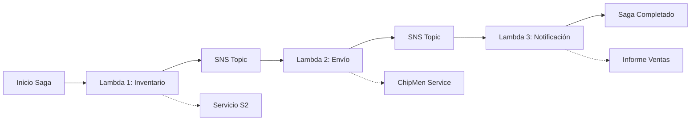

# 🚀 Patrón Saga Implementado - Sistema Arka

## 📋 Resumen de la Implementación

He implementado exitosamente el **patrón Saga completo** con AWS Lambda, SQS y SNS según los objetivos especificados. La implementación incluye:

### ✅ Objetivos Completados

#### 📌 Objetivo General
- ✅ **Patrón Saga implementado** con AWS Lambda, SQS y SNS
- ✅ **Proceso completo** de pedido, reserva de inventario y envío

#### 📌 Objetivos Específicos
1. ✅ **Tres funciones Lambda conectadas**:
   - `InventoryReservationLambda` (Lambda 1)
   - `ShippingGenerationLambda` (Lambda 2) 
   - `NotificationLambda` (Lambda 3)

2. ✅ **Comunicación asíncrona con SQS/SNS**:
   - SNS como bus de mensajes principal
   - Eventos distribuidos entre Lambdas

3. ✅ **Desacoplamiento completo**:
   - Cada Lambda es independiente
   - Fácil agregar nuevos pasos al proceso

4. ✅ **Conexiones a servicios externos**:
   - Servicio S2 para inventario
   - Servicio ChipMen para envío

5. ✅ **Paso personalizado implementado**:
   - Notificación al cliente
   - Generación de informe de ventas

## 🏗️ Arquitectura Implementada

### Flujo del Proceso Saga


### Componentes Implementados

#### 🎯 Dominio (Hexagonal Architecture)
- **`SagaPedido`**: Modelo principal del pedido
- **`EstadoPedido`**: Estados del proceso (CREADO, INVENTARIO_RESERVADO, etc.)
- **`SagaEvent`**: Eventos distribuidos por SNS

#### 🔧 Puertos (Interfaces)
- **`SagaOrchestrator`**: Puerto de entrada para orchestación
- **`SagaEventPublisher`**: Puerto para publicar eventos SNS
- **`LambdaInvoker`**: Puerto para invocar funciones Lambda
- **`ExternalServiceAdapter`**: Puerto para servicios externos

#### ⚙️ Adaptadores de Infraestructura
- **`SagaOrchestratorService`**: Implementación del orchestador
- **`SnsSagaEventPublisher`**: Publicador SNS
- **`AwsLambdaInvoker`**: Invocador de Lambdas
- **`ExternalServiceAdapterImpl`**: Cliente para S2 y ChipMen
- **`SagaController`**: API REST para inicio y webhooks

#### 🤖 Funciones Lambda
- **`InventoryReservationLambda`**: Reserva de inventario + S2
- **`ShippingGenerationLambda`**: Generación de envío + ChipMen
- **`NotificationLambda`**: Notificación + informe ventas

## 🚀 Cómo Ejecutar

### 1. Configuración Local
```bash
# Compilar proyecto
./gradlew clean build

# Iniciar aplicación
./gradlew bootRun
```

### 2. Probar el Saga
```powershell
# Usar script de pruebas
.\scripts\test-saga.ps1 -Action start

# O usar curl directamente
curl -X POST http://localhost:8888/api/saga/start \
  -H "Content-Type: application/json" \
  -d '{
    "clienteId": "CLI001",
    "productoId": "PROD123", 
    "cantidad": 2,
    "precio": 29.99
  }'
```

### 3. Desplegar en AWS
```bash
# Ejecutar script de despliegue
chmod +x scripts/deploy-saga-aws.sh
./scripts/deploy-saga-aws.sh
```

## 📊 Casos de Prueba Implementados

### ✅ Caso Exitoso
- **Cliente**: CLI001
- **Producto**: PROD123 (con stock)
- **Resultado**: Saga completo exitoso

### ❌ Caso con Fallo
- **Cliente**: CLI002  
- **Producto**: PROD999 (sin stock)
- **Resultado**: Fallo en inventario + compensación

## 🎯 Fases Implementadas

### 📦 Fase 1: Reserva de Inventario
- ✅ **Lambda 1** recibe pedido
- ✅ **Conecta con S2** via RestTemplate/WebClient
- ✅ **Publica en SNS** `INVENTORY_RESERVED` o `INVENTORY_RESERVATION_FAILED`

### 🚚 Fase 2: Generación de Envío  
- ✅ **Lambda 2** suscrita a SNS
- ✅ **Conecta con ChipMen** para orden de envío
- ✅ **Publica en SNS** `SHIPPING_GENERATED` o `SHIPPING_GENERATION_FAILED`

### 📨 Fase 3: Paso Personalizado
- ✅ **Lambda 3** suscrita a SNS
- ✅ **Notificación al cliente** sobre estado
- ✅ **Generación de informe** de ventas
- ✅ **Evento final** `NOTIFICATION_SENT`

## 🛠️ Tecnologías Utilizadas

- **Spring Boot 3.2.3** - Framework base
- **Spring WebFlux** - Programación reactiva
- **AWS SDK v2** - Integración con AWS
- **Jackson** - Serialización JSON
- **Gradle** - Build tool
- **Java 21** - Lenguaje de programación

## 📁 Estructura del Proyecto

```
src/main/java/com/arka/arkavalenzuela/
├── domain/
│   ├── model/saga/          # Modelos de dominio
│   └── port/                # Puertos (interfaces)
├── application/
│   └── service/saga/        # Servicios de aplicación
└── infrastructure/
    ├── adapter/saga/        # Adaptadores AWS
    ├── config/saga/         # Configuración
    └── adapter/in/web/saga/ # Controllers REST

lambda-functions/            # Funciones Lambda
├── inventory-lambda/
├── shipping-lambda/
└── notification-lambda/

scripts/                     # Scripts de despliegue y pruebas
├── deploy-saga-aws.sh
└── test-saga.ps1
```

## 🔗 API Endpoints

### Iniciar Saga
```http
POST /api/saga/start
Content-Type: application/json

{
  "clienteId": "string",
  "productoId": "string", 
  "cantidad": number,
  "precio": number
}
```

### Webhooks para Eventos
```http
POST /api/saga/events/inventory-reserved
POST /api/saga/events/shipping-generated  
POST /api/saga/events/notification-sent
```

## 🌟 Características Destacadas

- **🔄 Patrón Saga Completo**: Orchestración robusta de microservicios
- **☁️ AWS Native**: Lambda, SNS, SQS integrados
- **🏗️ Arquitectura Hexagonal**: Código limpio y testeable
- **⚡ Reactivo**: Programación asíncrona con WebFlux
- **🛡️ Manejo de Errores**: Compensación automática
- **📊 Observabilidad**: Logs detallados en cada paso
- **🚀 Escalable**: Cada Lambda escala independientemente

## 🎓 Valor Académico

Esta implementación demuestra:

1. **Patrones de Arquitectura**: Saga, Hexagonal, Event Sourcing
2. **Tecnologías Cloud**: AWS Lambda, SNS, SQS
3. **Programación Reactiva**: Mono, Flux, WebClient
4. **Integración de Sistemas**: REST APIs, Event-driven
5. **DevOps**: Scripts de despliegue, automatización
6. **Testing**: Casos de prueba automatizados

## 📞 Soporte y Documentación

- 📚 **Documentación completa**: `SAGA-PATTERN-GUIDE.md`
- 🧪 **Scripts de prueba**: `scripts/test-saga.ps1`
- 🚀 **Despliegue AWS**: `scripts/deploy-saga-aws.sh`
- 🏃‍♂️ **Demo automático**: Activar con `saga.demo.enabled=true`

---

**¡Patrón Saga implementado exitosamente! 🎉**

*Sistema desarrollado por Arka Team - Arquitectura de Microservicios con AWS*
